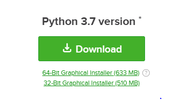
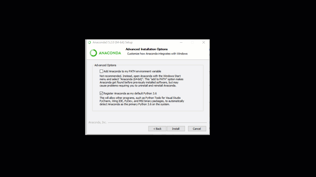

# Python in Jupyter op je eigen computer

## Om te beginnen

Om te kunnen programmeren op je eigen computer heb je twee verschillende programma's nodig: de taal zelf, en een goede editor:

1. **Anaconda**, een versie van Python die makkelijk te installeren is. Er zitten ook een boel *packages* bij, waarin extra functionaliteit zit voor grafieken, statistiek en nog allerlei andere dingen.

2. **Jupyter notebook**, een *omgeving* om code in te schrijven. De Jupyter omgeving wordt standaard geinstalleerd als je **anaconda** installeert.

### Stap 1: Anaconda

Dit pakket kunt je downloaden op de [website](https://www.anaconda.com/download/). Kies daar voor de "**Graphical Installer**" van **Python-versie 3.7**. De download is meer dan 500MB. Het kan dus even duren voordat het klaar is! Je hoeft trouwens je mailadres niet op te geven, ook zonder mag je Anaconda gewoon gebruiken.

{:style="max-width:35%"}

Zodra de download klaar is, moet je het gedownloade bestand uitvoeren (dubbelklik?). Volg dan de installatieinstructies en kies waar nodig voor "Install for me only"; als het goed is hoef je verder niks te veranderen.

Let op: kies op Windows altijd de "advanced" installatie en kruis onderstaande vinkje aan! Als je dit niet hebt gedaan moet je het verwijderen en opnieuw installeren!

De installatie kan een tijdje duren.

{:style="max-width:25%"}

### Stap 2: Jupyter

Jupyter wordt automatisch geinstalleerd als je **anaconda** installeert. Je kunt jupyter starten met het commando:

		jupyter notebook

Maar je kunt in het Start-menu (windows) ook een knop vinden om jupyter notebook te starten.

## Proefrit

Nu je jupyter notebook kunt opstarten, kunnen we gaan kijken of alles werkt. Volg de voorbeelden uit de video:

### Terminal

In Jupyter kun je een terminal openen door rechts-boven het "new" menu te
openen en daarin "Terminal" te kiezen: 

### Installeer `checkpy`

Om jou te helpen controleren of wat je programmeert ook daadwerkelijk in overeenstemming is met de opdracht, hebben wij een programma geschreven genaamd **checkpy**. Dit programma kun je installeren door in de terminal het volgende commando uit te voeren:

	pip install checkpy

Dit kan even duren, en je zult wat tekst over je scherm zien gaan. Daarna is checkpy geïnstalleerd. Installeer ook de CheckPy knop in Jupyter:

	pip install nbextension-run-checkpy

Behalve checkpy hebben we ook tests nodig om de opdrachten die jij zometeen gaat maken te testen. Deze tests kun je downloaden door het volgende commando in de terminal te voeren:

	checkpy -d uva/progns

Maak een notebook 'hello' volgens het instructiefilmpje hierboven en test dit notebook met de CheckPy knop:

[animatie]()

Kleurt alles groen en zie je alleen maar vrolijke smileys? Dan zit je goed, en heb je aan onze eisen voor de opdracht voldaan! Mocht er iets rood kleuren, geen paniek! Kijk goed na of je precies hebt gedaan wat er is gevraagd, en mail gerust als je klem zit.
