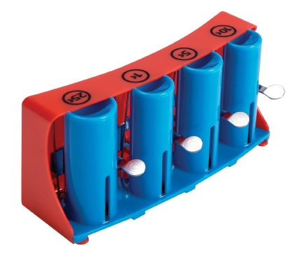

# Greedy

Implementeer een programma dat het minimaal aantal muntjes uitrekent om wisselgeld te geven. 

	Hoeveel wisselgeld moet er gegeven worden? 0.41
	4

## Achtergrond

In een ver verleden, toen er nog actief werd betaald door middel van contanten, was een muntenhouder als hierboven onmisbaar voor de verstokte koopjesjager. Het vervelende is dat er voor elk muntje een palletje moest worden ingedrukt, en dit kost tijd. Gelukkig zijn wij er al computer scientists om het aantal terug te geven muntjes te minimaliseren door middel van "greedy algoritmes".

Een greedy algoritme is een algoritme dat altijd de beste lokale keuze maakt op weg naar een antwoord. Alsof je fietst en dan op elk kruispunt de afslag kiest waarvan jij op dat moment denkt dat die zo snel mogelijk leidt tot je eindbestemming. Dit soort algoritmes leiden voor sommige problemen altijd tot een optimale oplossing, maar niet voor alle problemen.

Stel je voor dat een caissière een klant wisselgeld verschuldigd is, en dat deze caissière vervolgens op de palletje kan drukken om kwartjes (25c), dubbeltjes (10c), stuivers (5c), en centen (1c) te krijgen. We zoeken nu een oplossing voor dit probleem door één of meer keer te drukken op de palletjes, waarbij we zo min mogelijk een palletje willen indrukken.

We stellen ons nu een een "gretige" caissière voor, die elke keer als hij op een palletje moet drukken, op het palletje drukt met de hoogst mogelijk waarde waarop nog gedrukt mag worden. Bijvoorbeeld, als een klant nog 41 cent tegoed heeft, dan drukt de caissière eerst op het palletje voor een kwartje. Er blijft dan nog (41 - 25 =) 16 cent over. Nu mag de caissière niet meer drukken op het palletje voor een kwartje, want dan zou hij te veel wisselgeld geven. Dus drukt hij om een dubbeltje te geven, en daarmee blijft er nog 6 cent over. Dit volgt dan met een druk voor een stuiver, en tot slot een cent. In totaal krijgt de klant dus één kwartje, één dubbeltje, één stuiver, en één cent, dit maakt 4 munten in totaal.

Het blijkt dat bij zo'n gierige aanpak *altijd* het minste aantal munten door de vingers van de caissière gaat. De aanpak geeft dus *gegarandeerd een optimale oplossing* (let wel: dit geldt voor deze set munten). We nemen dan aan dat de voorraad muntstukken nooit opraakt.

Hoeveel munten er precies nodig zijn bij een bepaalde hoeveelheid wisselgeld? Dat mag jij ons vertellen!

## Specificatie

* Schrijf in een bestand genaamd `greedy.py` een programma dat eerst vraagt hoe veel wisselgeld er gegeven moet worden, en vervolgens het minimaal aantal munten uitspuwt.

* Ga er vanuit dat de gebruiker een getal als geheel getal (integer), of als kommagetal invult (nou ja, een puntgetal, want het werkt op z'n Amerikaans). Het getal achter de komma staat in dat laatste geval voor centen. Dus `3.21` betekent 3 dollar en 21 cent.

* [Slaagt de gebruiker er niet in om correcte input te geven](https://en.wikipedia.org/wiki/Murphy's_law), zorg dan dat er opnieuw geprobeerd kan worden.

## Hints

* De structuur van dit programma lijkt een beetje op die van `water.py`: er is weer duidelijk sprake van invoer, berekening en uitvoer. Het verschil is dat je de berekening nu niet meer kunt schrijven als één formule. Je moet een compleet *algoritme* bedenken!

* Het is handig om gedurende het programma een variabele bij te houden waarin je werkt aan het uiteindelijke antwoord: het aantal terug te geven munten.

* Zorg dat, zodra de gebruiker een float heeft ingevuld, je hiervan een integer maakt. Onze munten zijn immers gespecificeerd in een aantal *centen*.

* Om eventuele afrondingsfouten te voorkomen bij het converteren van floats naar integers, rond getallen eerst af door middel van `round()`. Probeer maar eens: `round(7.8)` en `round(7.2)`.

* Hoe je dit probleem precies aanpakt is verder aan jou. Je zou bijvoorbeeld loops kunnen gebruiken of gebruik kunnen maken van de modulo operator `%`. Probeer maar eens `26 % 8`.

## Testen

	checkpy greedy

(Je weet nu hoe het testen werkt, toch?)
