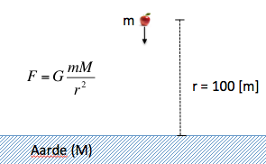

# Simulaties

In het natuurkundig onderzoek wordt veel gewerkt met problemen die niet  analytisch, met de hand, zijn op te lossen. Toch zijn er allerlei technieken die, vaak met een omweg, voor dit soort problemen een oplossing kunnen genereren. In de meeste gevallen is zo'n techniek wel heel arbeidsintensief en worden altijd computers gebruikt om ze toe te passen.

In deze module kijken we naar twee technieken: het *simuleren* van fysieke situaties en het *fitten* van meetgegevens.

Bij simuleren neem je stapjes in de tijd en bereken je wat er in die tijd grofweg is gebeurd: bijvoorbeeld de beweging van een object. De truc die je dan eigenlijk alleen met een computer handig kan toepassen, is dat je de tijdstapjes zó klein maakt, dat je de beweging steeds "vloeiender" aan het doorrekenen bent. Uiteindelijk beschrijft de simulatie dan bijna precies het daadwerkelijke gedrag. Tenminste, als de simulatie van de juiste aannames uit gaat!

We starten nu met een probleem waarbij je de antwoorden zelf nog kunt
controleren en uitrekenen met behulp van natuurkunde van de middelbare school, maar daarna ben je op je programmeer-skills en je natuurkundige intuitie aangewezen om uiteindelijk tot het het antwoord te komen.
# Opdracht: een appel valt van de Dom

Schrijf een functie `appel()` in een bestand **appel.py** die de beweging van de appel beschrijft als die op een hoogte van 100 meter wordt losgelaten.

Zorg dat je programma kleine stapjes in de tijd maakt ($$\Delta t=0.01$$
seconden) en hou steeds bij op welke hoogte de appel zich bevindt ($$x$$) en met
welke snelheid deze beweegt ($$v$$).

Bereken voor elke nieuw stapje in de tijd en in deze volgorde:

1. de kracht die op de appel werkt (F)
2. de versnelling die de appel daardoor krijgt (a)
3. de nieuwe snelheid die de appel daardoor krijgt (v)
    gebruik: $$v_{\rm nieuw} = v + a \Delta t$$
4. de nieuwe positie van de appel (x). 
    gebruik: $$x_{\rm nieuw} = x + v \Delta t$$

(Stap 1 en 2 kun je combineren, waardoor je in deze simulatie niet hoeft te weten wat de massa van de appel is!)

Je hebt dan alle informatie berekend over een bepaald punt in de tijd. Vervolgens kun je een stapje verder in de tijd maken en deze cyclus herhalen.

## Uitvoer

Zorg dat de volgende resultaten geprint worden door je programma:

1. Na hoeveel seconden raakt de appel de grond?

2. Met welke snelheid (km/uur) raakt de appel de grond?

3. Na hoeveel seconden heeft de appel een snelheid van 100 km/uur bereikt? Is
    een vallende appel daarmee sneller dan Bugatti Veyron (2.46 seconden) of niet?

De uitvoer moet heel precies zijn en alleen de gevraagde waarden bevatten elk op een aparte regel in dezelfde volgorde als hierboven. Bijvoorbeeld zo:

	000 s tot de appel de grond raakt
	000.0 km/uur is de snelheid waarmee de appel de grond raakt
	0.00 s duurt het tot de appel 100 km/uur gaat

## Tips

- Gebruik bovenstaande formule en start de appel dus op x = $${\rm R_{earth}}$$ + 100 meter. Als je wilt weten hoe hoog de appel is, gebruik dan h = x - $${\rm R_{earth}}$$.
- Let goed op het teken van de krachten en snelheden. je begint bij positieve $$x$$ en beweegt dan naar $$x=0$$ toe.
- In dit voorbeeld kan je de antwoorden ook zelf uitrekenen met behulp van pen en papier.
- Bereken alles eerst in m/s en reken dan voor punt 2 de snelheid om naar km/uur.

## Testen

	checkpy appel