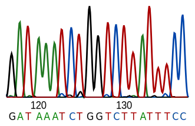

# DNA-matching

Een bekend probleem in biologie is het begrijpen van de structuur van
DNA-moleculen en de rol die specifieke patronen in die structuur spelen. De
structuur van DNA wordt doorgaans gerepresenteerd als een reeks die is
opgebouwd uit vier soorten nucleotiden: adenine (A), cytosine (C), guanine (G),
or thymine (T). Hieronder zie je een chromatogram waarin de opbouw van een
stukje DNA wordt weergegeven. Voor verdere verwerking worden DNA-strengen
gerepresenteerd als reeksen uit een alfabet van de vier symbolen; een
voorbeeld van zo'n reeks is AAACAACTTCGTAAGTATA.

{:.inline}

Bepaalde DNA-sequenties hebben invloed op de bouw en werking van een levend
organisme. Een manier waarop men probeert te begrijpen wat een onbekende
DNA-sequentie voor informatie bevat is deze vergelijken met DNA-sequenties uit
een bibliotheek van structuren waarvan de informatie al bekend is. Het idee
hierachter is dat vergelijkbare structuur een vergelijkbare informatie
impliceert.

In deze opdracht gaan we aan de slag met het vergelijken van en werken met
DNA-strings. Zo kun je inzicht krijgen in de problemen waar onderzoekers die
bezig zijn met DNA-string matching mee kampen. Simpele organismen zoals
bacteriën hebben al miljoenen nucleotiden in hun DNA-sequentie. Een menselijk
chromosoom heeft iets in de orde van grootte van 246 miljoen nucleotiden te
hebben. Dit betekent dat elke vorm van matching in de bibliotheek *efficiënt*
moet gebeuren om bruikbaar te zijn. Bovendien moet het matchen werken als er kleine afwijkingen zijn.
# Matches tellen

Maak een functie die het *aantal* keer telt dat een `needle` in een `haystack` voorkomt.

    >>> result = count_exact_matches("atgacatgcacaagtatgcat", "atgc")
    >>> print result
    2

## Specificatie

- Maak een nieuw bestand aan met de naam `countmatches.py`.
- Definieer zelf een functie `count_exact_matches` met twee parameters:
	- `haystack`, dat is de string waarin we zoeken
	- `needle`, dat is de string die we zoeken
- De functie moet een waarde `return`en: het aantal keer dat de `needle` in de `haystack` voorkomt

## Hints

- Maak gebruik van de functie `find`.
- Hou in een variabele bij waar in de string je gebleven bent.

## Testen

Test je functie met `checkpy`!

    checkpy countmatches
