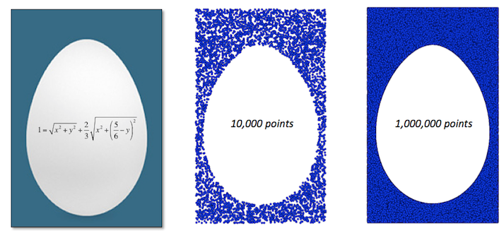

# Het twitter-ei!

Schrijf een programma `twitter()` dat de oppervlakte van het Twitter-ei berekent. De omtrek van het ei wordt gegeven door: 

$$ \sqrt{x^2+y^2} + \frac{2}{3}\sqrt{x^2+\left(\frac{5}{6}-y \right)^2 } = 1$$

Gooi in totaal 1 miljoen punten en bereken de juiste oppervlakte. Bewaar na elke 1000 punten dat je gooit de schatting van de oppervlakte op dat moment. Als het goed is convergeert je antwoord en zie je dat je een betere schatting krijgt naarmate je meer punten gooit.

Je programma moet drie dingen doen:

   - print het antwoord van de oppervlakte ook op het scherm, op 2 decimalen nauwkeurig
       De oppervlakte van het Twitter ei is x.xx 

   - plot de distributie van de goede en slechte punten (zoals de rechter plot hierboven). Geef ook in de grafiek aan wat de oppervlakte is. Ook hier op 2 decimalen nauwkeurig.

