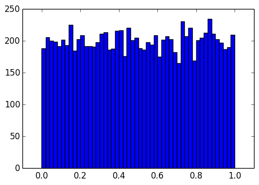

# Histogram

Schrijf een programma dat de distributie van getallen uit de `random`-functie visualiseert:

## Achtergrond

Een grafiek van een functie tekenen, zoals in de vorige module, is één manier om gegevens te visualiseren. Dit is niet altijd de meest logische manier. Als de Volkskrant bijvoorbeeld een grafiek maakt van de lengte van mensen in Nederland dan gebruiken ze een zogenaamd `histogram` (ook wel een staafdiagram of frequentiedistributie) waarbij de data gegroepeerd wordt. Er wordt bijvoorbeeld bijgehouden hoeveel (procent van de) mensen een lengte hebben in een bepaald interval, bijvoorbeeld tussen 160 en 165cm, maar ook tussen 165-170, 170-175 etc etc. Die manier om de data te representeren geeft gelijk een goed beeld van de verhoudingen tussen de verschillende groepen.

## Voorbeeld: 10.000 random getallen

Het idee van een random getal is dat het uniform verdeeld is tussen 0 en 1. Om een indruk te kijken of de verdeling inderdaad 'vlak' is kunnen we van 10.000 random getallen kijken wat de frequentie is van de getallen die gegenereerd zijn.

Hieronder een klein programma dat eerst 10.000 random getallen genereert en ze in een lijst stopt. Bij het commando `plt.hist()` wordt opgegeven dat we de frequentie willen bepalen van getallen in gebieden van 0.02 (immers 50 bins tussen de minimale en maximale waarde die we verwachten: 0.00 en 1.00).

    import random
    import matplotlib.pyplot as plt

    # lijst waar je de random getallen in bewaart
    random_getallen = []

    # genereer 10.000 random getallen
    n = 10000
    for counter in range(n):
        getal = random.random()          
        random_getallen.append(getal)

     # plot de frequentie-distributie (50 bins)
     plt.xlim(-0.1, 1.1)
     plt.hist(random_getallen, bins=50)
     plt.show()

In Python gebruik je hiervoor de optie `plt.hist()` om de data te groeperen en laat het dan pas zien mbv `plt.show()`. Je kunt bij het groeperen opgeven in hoeveel stukjes (bins) je de data op wilt delen.

De extra optie `xlim` gebruiken we hier om te laten zien dat er geen getallen buiten het interval 0.00-1.00 zijn gegenereerd. Kijk in de documentatie op het web welke opties er allemaal zijn om het histogram de vorm te geven die jij wilt: relevant aantal bins, kleur, asbijschriften, legenda, tekst, etc etc.

## Opdracht: distributie van de som van random getallen

Dat de random getallen zelf keurig uniform tussen 0 en 1 verdeeld zijn hebben we net gezien, maar hoe zit het eigenlijk met de verdeling van de som van 100 random getallen? Als we een 'experiment' doen waarbij we 100 random getallen getallen genereren en bij elkaar optellen zal daar gemiddeld 50 uitkomen (omdat het gemiddelde getal 0.5 is), maar voor een individueel experiment is dat zelden precies 50 natuurlijk. De vraag is nou: hoe vaak vind je toevallig dat de som minder is dan 40? En komt dat evenveel voor als het aantal experimenten waarbij de som meer dan 60 is?

Schrijf een functie `SomRandomGetallen()` dat de distributie weergeeft van 10.000 experimenten. Teken de resultaten tussen x=30 en x = 70.

Genereer voor elk 'experiment' 100 random getallen en reken de som daarvan uit. Herhaal dit 10.000 keer en bewaar voor elk van de experimenten de som in een lijst. Maak uiteindelijk een frequentie-distributie (histogram) van de verdeling. Schrijf ook naar het scherm wat het percentage (in procent) van de  experimenten is waarbij de som respectievelijk minder dan 40 en meer dan 60 is.

> Let op: print het percentage < 40 op één regel en het percentage > 60 op de volgende. Print bovendien niet alleen het percentage maar leg even uit wat het precies voor getal is.

## Testen

	checkpy histogram
