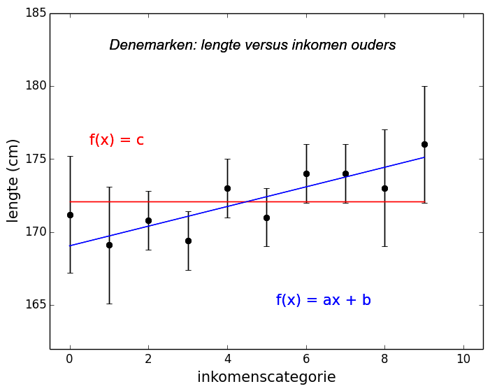
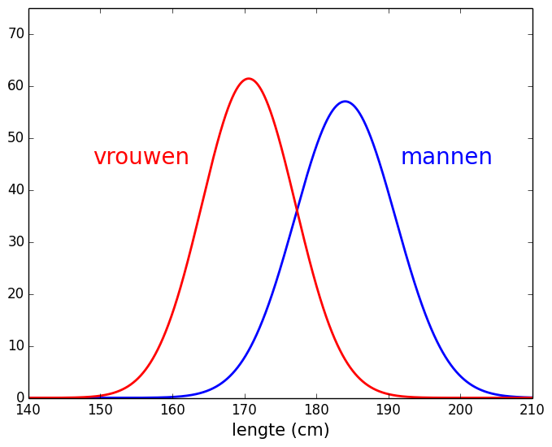

# Statistiek #

Als er een onderdeel is dat studenten van verschillende opleidingen verbindt is het wel de 
vrees voor (het gebrek aan kennis over) statistiek. En toch is het in elke wetenschappelijke 
discipline een cruciaal onderdeel omdat het de sleutel is tot het trekken van conclusies uit 
verzamelde gegevens. Wat is de 'waarheid' die verborgen ligt in de data en hoe kunnen 
verschillende hypotheses tegen elkaar afgewogen worden. In deze module zullen we aan de 
hand van een verzonnen casus een paar van de meest voorkomende technieken bekijken.

{:.inline}{: style="width:35%"}

**De casus:** In Denemarken is een onderzoeksgroep gaan bestuderen of de lengte van vrouwen 
gecorreleerd is met het inkomen van hun ouders. De inkomenscategorie&euml;n lopen van 
categorie-0 (zeer arm) tot categorie-10 (zeer rijk) en in elke categorie is een willekeurig 
aantal vrouwen geselecteerd van wie de lengte is gemeten. De data (de gemeten gemiddelde lengte 
voor elke inkomenscategorie) is weergegeven in de grafiek hiernaast. En hier beginnen de problemen.
Een deel van de onderzoekers vindt dat de data suggereert dat er een duidelijk lineair 
verband te zien is (blauw) terwijl een andere groep vindt dat er helemaal geen afhankelijkheid 
is (rood). Die laatste groep zegt dat de geobserveerde lichte afhankelijkheid gewoon het resultaat 
van de toevallige fluctuaties in de lengte van vrouwen die in de steekproeven geselecteerd zijn. 

We gaan in deze module na een paar korte inleidende oefeningen proberen te achterhalen welke 
conclusies we kunnen trekken: is er nou wel of niet een (al dan niet causaal) verband?

Hoewel het niet de bedoeling is om hier een volledig statistiek college te verzorgen zullen we er 
niet aan ontkomen om naast een aantal nieuwe Python ingredienten ook wat statistiek te introduceren 
in de voorbereiding op een opdracht.
 
## Opdracht 1: percentage vrouwen dat langer is dan de gemiddelde man

In de eerste opdracht zullen we de vraag beantwoorden welk percentage van de vrouwen in Nederland langer 
is dan de gemiddelde man. Voor deze opdracht is het concept normaalverdeling en het manipuleren 
daarvan in Python erg belangrijk.

#### Statistiek info voor opdracht 1:  de normaalverdeling 

In de natuur komt overal variatie voor: de lengte van mensen in een land, of het gewicht van 
dieren in een populatie om er maar een paar te noemen. De verdeling die de relatieve frequentie 
beschrijft waarmee een specifieke waarde $$x$$ voorkomt in de populatie van metingen wordt beschreven 
volgens de zogenaamde normaalverdeling:

$$ f(x,|\mu,\sigma) = \frac{1}{\sigma\sqrt{2\pi}} exp^{-\frac{1}{2}\left( \frac{x-\mu}{\sigma} \right)^2}$$

{:.inline}{: style="width:35%"}

Deze verdeling, ook wel de Gaussische distributie genoemd, wordt gekarakteriseerd door maar 
twee parameters: het gemiddelde ($$\mu$$) en de maat voor de spreiding ($$\sigma$$). Er geldt 
dat ongeveer 68%(95%) van de waarden in het gebied $$\mu \pm 1\sigma$$ ($$\mu \pm 2\sigma$$) ligt.

De lengte van mannen (vrouwen) in Nederland wordt bijvoorbeeld beschreven door een normaalverdeling 
met een gemiddelde $$\mu$$ = 184.0 (170.6) cm en breedte $$\sigma$$ = 7.0 (6.5) cm.  Dit betekent 
dat 34% van de mannen langer is dan 191 cm en dan 2.5% van de vrouwen kleiner is dan 157.6 cm. 
De (genormeerde) grafieken van de twee verdelingen staan in grafiek hiernaast.

 

#### Python info voor opdracht 1: random getallen uit een normaalverdeling 

We hebben eerder gezien hoe je een random getal trekt in Python tussen 0 en 1. Het is ook mogelijk 
om een random getal te trekken uit een bepaalde verdeling en omdat de normaalverdeling zo'n prominente 
plek inneemt is daar een standaard functie voor in Python (in de `numpy` bibliotheek) met de volgende 
syntax:

{: .language-python}
    gemiddelde = 170.6
    breedte = 6.5
    lengte = numpy.random.normal(gemiddelde,breedte)

Als je dit heel vaak herhaalt zullen de waardes van $$x$$ verdeeld zijn volgens de rode grafiek 
hierboven.

#### Opdracht 1: verdeling lengtes van alle vrouwen

Schrijf een programma `statistiek_opdracht1.py()` waarin je 1 miljoen random getallen trekt uit de 
normaalverdeling die de lengte van vrouwen in Nederland beschrijft. Maak een grafiek van 
al deze random lengtes. Gebruik hiervoor een histogram met bins die elk een breedte van 
0.5 cm hebben. Hou bij het trekken van de random lengtes bij hoeveel vrouwen een lengte 
hebben die groter is dan die van de gemiddelde man. Print aan het eind van het programma 
dit percentage lange vrouwen met 2 decimalen nauwkeurigheid.

{: .language-python}
    Het percentage lange vrouwen (langer dan 184 cm) is X.XX procent
